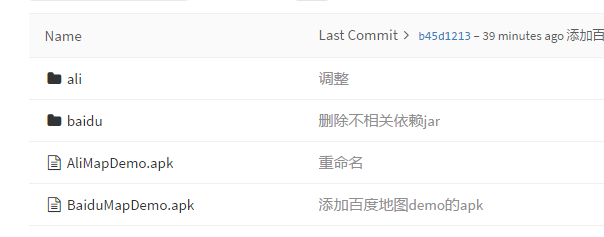

### 高德地图、百度地图调研

### 一、效果图

+ 地图滑动停止后，以屏幕中心为圆心，随机生成10个用户并将其显示在对应的Map上；
+ 点击对应的用户(红色气球)，弹出该用户对应的`用户名` 与 `课程名称`

效果图如下：

ps：
显示在地图上的`Marker`  与 `InfoWindow`  均`可自定义为其他图片或者View`。
*以上效果，高德地图与百度地图均可实现。*

### 二、git地址
已上传到git地址：https://github.com/xiaxveliang/Android_Map_Demo

其中：
+ `ali`为高德地图demo实现代码；
+ `baidu`为百度地图demo实现代码；
+ `AliMapDemo.apk` 为高德地图demo实现安装包；
+ `BaiduMapDemo.apk` 为高德地图demo实现安装包；

### 三、`高德地图` `百度地图` 依赖包大小对比

| 依赖包大小对比      |     定位SDK|   地图SDK   |
| :-------- | --------:| :------: |
| 高德地图    |   301 KB |  519 KB  |
| 百度地图    |   1.51 MB |  15.29 MB  |

**由上表可以看出：实现相同的效果，高德地图的依赖包要远远小于百度地图**

**高德地图demo依赖包：**

**百度地图demo依赖包：**

ps：
*高德地图，开发非3D地图效果，不需要添加 .so依赖*

### 四、关于“国家甲级测绘资质”
高德和百度好像都有：[甲级测绘资质单位名录](http://zgchnj.sbsm.gov.cn/article/ljnjll/ysnj/fl/jjchzzdwml/201312/20131200005814.shtml)

### 五、`高德地图` `百度地图` 对应SDK下载地址

高德定位sdk：
http://lbs.amap.com/api/android-location-sdk/locationsummary/

高德定位sdk API文档：
http://amappc.cn-hangzhou.oss-pub.aliyun-inc.com/lbs/static/unzip/Android_Location_Doc/index.html

高德地图sdk：
http://lbs.amap.com/api/android-sdk/gettingstarted

高德地图sdk API文档：
http://a.amap.com/lbs/static/unzip/Android_Map_Doc/index.html

百度定位SDK：
http://lbsyun.baidu.com/index.php?title=android-locsdk/guide/buildprojec

百度定位SDK API文档：
http://wiki.lbsyun.baidu.com/cms/androidloc/doc/v7.1/index.html

百度地图SDK：
http://lbsyun.baidu.com/index.php?title=androidsdk/guide/introduction

百度地图SDK API文档：
http://wiki.lbsyun.baidu.com/cms/androidsdk/doc/v4_3_0/index.html

### 六、网上找的一个`高德地图` `百度地图` 对应对比评测
http://net.chinabyte.com/304/13513804.shtml

### 七、`高德地图`成功案例
[高德地图开放平台](http://lbs.amap.com/)

